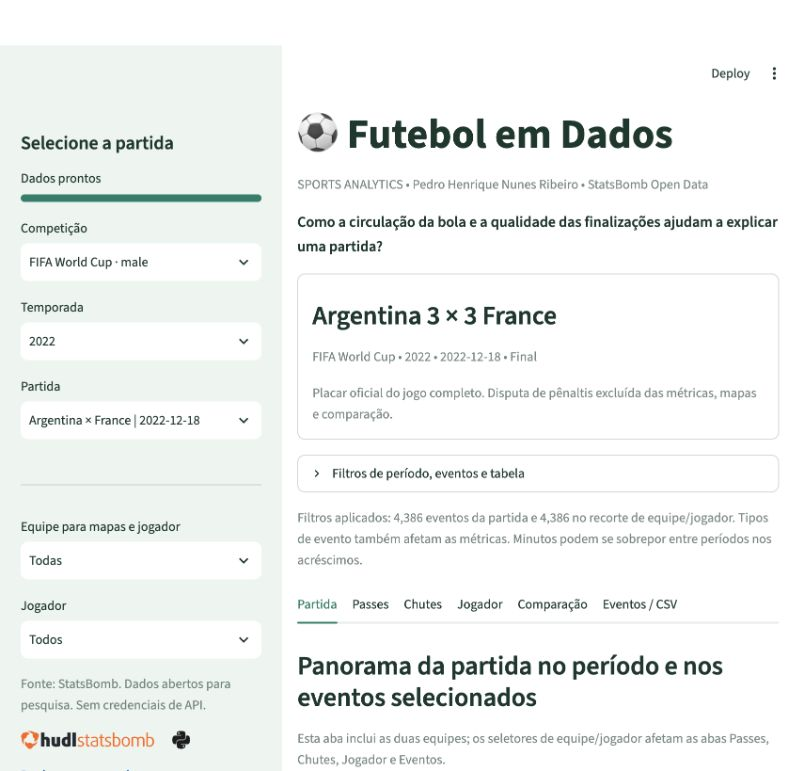

# ⚽ Futebol em Dados

**Assessment DR1 • Pedro Henrique Nunes Ribeiro**

Dashboard de Sports Analytics em Python/Streamlit para investigar: **como a circulação da bola e a qualidade das finalizações ajudam a explicar uma partida?** Usa exclusivamente dados abertos da StatsBomb, consultados com StatsBombPy, sem necessidade de chave de API.



## Links de entrega

- **GitHub:** https://github.com/pedro-ribeiro00/football-analytics-dashboard-dr1-at
- **Streamlit Community Cloud:** PENDENTE DE PUBLICAÇÃO. Substituir este campo pela URL real após o deploy. Não é um link ativo.
- **Relatório:** [Pedro_Henrique_Nunes_Ribeiro_DR1_AT.PDF](docs/Pedro_Henrique_Nunes_Ribeiro_DR1_AT.PDF).

## Executar localmente

Versão validada: **Python 3.12.14**. Use Python **3.12** para reproduzir o ambiente. Internet é necessária para instalar as dependências e consultar o catálogo/eventos; não há base fictícia nem modo offline silencioso.

```bash
python3.12 -m venv .venv
source .venv/bin/activate
python -m pip install -r requirements.txt
python -m streamlit run app.py
```

No Windows, substitua os dois primeiros comandos por:

```powershell
py -3.12 -m venv .venv
.venv\Scripts\Activate.ps1
```

Abra o endereço mostrado pelo Streamlit, normalmente `http://localhost:8501`. Execute os comandos na pasta que contém `app.py`. O ambiente virtual não está incluído no ZIP porque depende do sistema operacional; os arquivos de dependências permitem recriá-lo.

## Roteiro de uso

1. Escolha competição, temporada e partida na barra lateral. A seleção inicial é **FIFA World Cup / 2022 / Argentina × França**, final de 18/12/2022 (ID 3869685). As 64 partidas da competição foram encontradas na consulta de validação.
2. Abra **Filtros de período, eventos e tabela**, escolha os períodos, intervalo inclusivo de minutos, tipos de evento e quantidade de linhas. Clique em **Aplicar filtros**.
3. Em **Partida**, confira as métricas das duas equipes, o xG acumulado e a relação entre passes e xG dos jogadores.
4. Selecione uma equipe e/ou jogador na sidebar. **Passes**, **Chutes**, **Jogador** e **Eventos / CSV** usam esse recorte.
5. Em **Passes**, alterne o mapa mplsoccer com a visualização interativa, com hover e zoom. Em **Chutes**, ambos os formatos estão disponíveis. Os campos de fundo da versão Plotly são desenhados com mplsoccer.
6. Em **Jogador**, consulte métricas e densidade das ações. Em **Comparação**, escolha dois jogadores e confirme o formulário; ambos usam os mesmos filtros temporais e de eventos, independentemente do jogador da sidebar.
7. Em **Eventos / CSV**, consulte a tabela, busque literalmente parte do nome de um jogador e baixe todos os eventos filtrados. O limite de linhas afeta apenas a exibição. O CSV contém todas as colunas e usa UTF-8 com BOM para preservar os acentos no Excel.

## Arquitetura

```text
football-analytics-dashboard/
├── app.py                    # Interface, formulários e estado da sessão
├── requirements.txt          # Dependências de execução fixadas
├── requirements-dev.txt      # Testes
├── pytest.ini
├── README.md
├── VALIDACAO.md
├── .gitignore
├── .streamlit/config.toml    # Tema e configuração
├── src/
│   ├── __init__.py
│   ├── data.py               # StatsBombPy, cache, normalização, filtros e CSV
│   ├── metrics.py            # Métricas puras por evento/jogador/equipe
│   └── charts.py             # mplsoccer, Matplotlib, Seaborn e Plotly
├── tests/
│   └── test_metrics.py
└── assets/                   # Figuras, screenshot e atribuição da marca
```

Fluxo: StatsBomb Open Data → StatsBombPy → DataFrame normalizado → filtros → métricas e gráficos → Streamlit e CSV. Campos opcionais ausentes recebem valores apropriados; eventos sem coordenadas ficam nas métricas, mas não nos mapas.

## Bibliotecas e recursos

| Tecnologia | Papel |
|---|---|
| Streamlit | Sidebar, columns, containers, tabs, forms, metric, dataframe, download, spinner e progress |
| StatsBombPy | Competições, temporadas, partidas, eventos e escalações públicas |
| Pandas / NumPy | Transformação tabular e suporte numérico |
| mplsoccer / Matplotlib | Campos, setas de passes, chutes e mapa de calor |
| Seaborn | Dispersão entre passes e xG por jogador |
| Plotly | Hover, zoom, xG acumulado e comparação de jogadores |

O cache `st.cache_data` tem TTL de 24 horas e limita a oito partidas o armazenamento de eventos/escalações. O `st.session_state` guarda o contexto e a dupla da comparação; os seletores têm chaves ligadas à competição/partida. Formulários agrupam alterações, evitando refazer a análise a cada edição. Spinner e barra de progresso refletem etapas concluídas de carga, sem atrasos artificiais.

## Definições e limites

- **Passes completos:** `type == Pass` sem `pass_outcome`. Precisão = completos ÷ passes × 100.
- **Chutes e gols:** eventos `Shot`; gol quando `shot_outcome == Goal`. Gols contra aparecem em coluna separada e não contam como finalização convertida. O placar oficial vem dos metadados e não muda com os filtros.
- **Conversão:** gols de finalizações ÷ chutes × 100. Sem denominador, a interface mostra “—”.
- **xG:** soma de `shot_statsbomb_xg`. É uma estimativa do modelo da StatsBomb, não uma previsão garantida do placar.
- **No alvo:** resultados `Goal`, `Saved` e `Saved to Post`.
- **Desarmes ganhos:** eventos `Duel` / `Tackle` com resultado `Won`, `Success`, `Success In Play` ou `Success Out`.
- **Cartões:** união dos campos de cartão em faltas e mau comportamento, contando no máximo um cartão por evento.
- **Disputa de pênaltis:** período 5 excluído de todas as métricas, mapas e comparação; tabela separada disponível em Eventos. Pênaltis durante o jogo e a prorrogação estão incluídos.
- **Tempo:** filtro usa `minute` inclusivo e seleção explícita de períodos. Acréscimos podem gerar minutos repetidos entre períodos. A curva de xG usa a ordem dos chutes, evitando a regressão do relógio.
- **Coordenadas:** padrão StatsBomb 120 × 80, normalizadas no sentido de ataque. Mapas com as duas equipes sobrepõem ações no mesmo sentido; selecione uma equipe para interpretação individual.
- **Calor:** contagem de eventos com localização; não representa rastreamento, posse, distância percorrida ou toques exatos.
- **Comparação:** totais absolutos no recorte, sem métricas por 90 minutos. Posição e tempo jogado influenciam a interpretação. Reservas sem eventos têm valores zerados.
- **Filtros de eventos:** afetam os indicadores. Se selecionar apenas Pass, os chutes serão zero por construção. Limpar todos os tipos/períodos retorna uma análise vazia explicitamente.
- **Cobertura:** somente competições e partidas disponibilizadas na base aberta. Uma partida permite descrição, não inferência causal nem conclusão geral sobre um campeonato.

## Exemplo validado: final da Copa de 2022

Consulta em 26/09/2026; períodos 1 a 4, todos os eventos, sem disputa de pênaltis:

| Indicador | Argentina | França |
|---|---:|---:|
| Placar | 3 | 3 |
| Passes | 693 | 570 |
| Completos | 560 | 434 |
| Precisão | 80,81% | 76,14% |
| Chutes | 20 | 10 |
| xG | 2,758 | 2,273 |
| Conversão | 15,00% | 30,00% |

A Argentina teve mais circulação e finalizações, mas a França converteu uma proporção maior dos chutes. A diferença de xG foi menor que a diferença no volume de chutes, sugerindo maior qualidade média das chances francesas nessa partida. Isso ajuda a contextualizar o empate, sem demonstrar causalidade.

## Testes

```bash
python -m pip install -r requirements-dev.txt
python -m pytest -q
# Integração com rede (opcional):
python scripts/validate_app.py
python scripts/validate_navigation.py
```

Os testes verificam exclusão da disputa, métricas e denominadores vazios, filtros, coordenadas ausentes e CSV com acentos. Veja `VALIDACAO.md` para os testes de integração realizados com dados reais e Streamlit AppTest.

## Publicar no Streamlit Community Cloud

1. Publique esta pasta na raiz de um repositório GitHub. Não envie `.venv`, caches ou segredos.
2. Acesse https://share.streamlit.io/ com sua conta e escolha **Create app**.
3. Selecione o repositório, a branch `main` e o arquivo `app.py`.
4. Nas opções avançadas, selecione **Python 3.12**. As dependências estão em `requirements.txt`; não há necessidade de secrets ou `packages.txt`.
5. Conclua o deploy e teste competição, partida, mapas, comparação e CSV no endereço público.
6. Substitua o marcador de URL neste README e no relatório. Um servidor local saudável não confirma publicação na nuvem.

Se o download dos dados falhar, confira a conexão ou a disponibilidade do GitHub/StatsBomb e use **Tentar novamente**. O aplicativo mostra o erro sem inventar estatísticas. Atualize versões somente após repetir os testes.

## Fontes e créditos

- [StatsBomb Open Data e condições de uso](https://github.com/hudl/open-data)
- [StatsBombPy: documentação oficial](https://github.com/hudl/statsbombpy)
- [Galeria oficial mplsoccer](https://mplsoccer.readthedocs.io/en/latest/gallery/index.html)
- [Deploy oficial do Streamlit Community Cloud](https://docs.streamlit.io/deploy/streamlit-community-cloud/deploy-your-app/deploy)

**Fonte dos dados: StatsBomb.** Logotipo oficial incluído para atribuição (ver `assets/ATRIBUICAO.md`). Este é um projeto acadêmico independente, sem afiliação ou endosso da StatsBomb/Hudl. O uso dos dados permanece sujeito aos termos do provedor; o projeto não altera a licença dos dados ou da marca.
